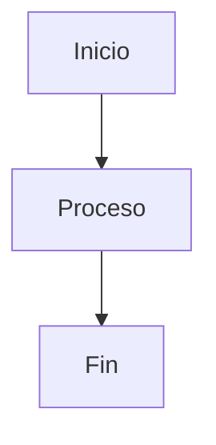

# 📚 Guía de Instalación - Documentación VitePress

Guía rápida para poner en marcha el proyecto de documentación.

## ✅ Requisitos

Antes de empezar, asegúrate de tener instalado:

- **Node.js** (versión 18 o superior) - [Descargar aquí](https://nodejs.org/)
- **pnpm** - Se instalará automáticamente con el proyecto

## 🚀 Pasos para Instalar

### 1️⃣ Abrir la terminal en la carpeta del proyecto

```bash
cd ruta/del/proyecto
```

### 2️⃣ Instalar todas las dependencias

```bash
pnpm install
```

⏳ Esto tardará un momento. Instalará todo lo necesario automáticamente.

### 3️⃣ Iniciar el servidor de desarrollo

```bash
pnpm run docs:dev
```

✨ Listo! Abre tu navegador en: `http://localhost:5173`

---

## 📝 Cómo usar en los archivos .md

### Videos de YouTube

Para agregar un video, copia y pega esto en tu archivo `.md`:

```markdown
<ClientOnly>
  <lite-youtube 
    videoid="4H32o8537BA" 
    videotitle="Título del video"
  />
</ClientOnly>
```

> 💡 Cambia solo el `videoid` por el ID de tu video de YouTube

### Diagramas Mermaid

Para crear un diagrama, usa este formato:

````markdown

````

---

## 🎯 Comandos Importantes

| Comando                 | Para qué sirve                              |
| ----------------------- | ------------------------------------------- |
| `pnpm install`          | Instalar dependencias (solo la primera vez) |
| `pnpm run docs:dev`     | Ver la documentación en modo desarrollo     |
| `pnpm run docs:build`   | Generar versión final para publicar         |
| `pnpm run docs:preview` | Ver cómo quedará la versión final           |

---

## ✅ Antes de hacer `git push`

**Siempre prueba que todo compile correctamente:**

```bash
pnpm run docs:build
```

Si no da errores ✅ → Ya puedes hacer `git push`

Si da errores ❌ → Revisa los archivos .md que modificaste

---

## ⚠️ Si algo no funciona

1. **Cierra la terminal** y vuelve a abrirla
2. **Borra estas carpetas/archivos:**
   - `node_modules`
   - `pnpm-lock.yaml`
3. **Vuelve a instalar:**

```bash
pnpm install
pnpm run docs:dev
```

---

## 📦 ¿Qué incluye este proyecto?

- ✅ **VitePress** - Para crear la documentación
- ✅ **Mermaid** - Para crear diagramas
- ✅ **Lite YouTube** - Para videos optimizados
- ✅ **Tailwind CSS** - Para estilos modernos
- ✅ **Vue 3** - Framework base

**¡Todo está listo para usar! No necesitas configurar nada más.** 🎉
