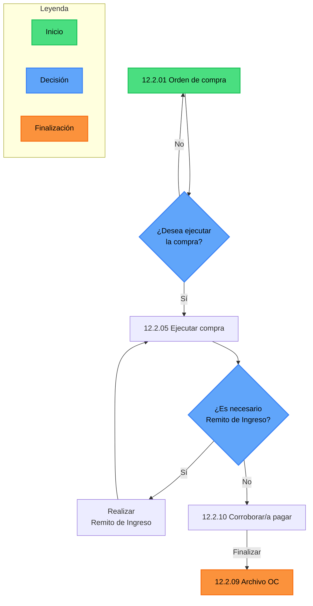

# Registrar pagos relizados con tarjetas de credito

```mermaid
flowchart TD
   A["12.2.01 Orden de compra"]:::inicio --> B{"¿Desea ejecutar<br/>la compra?"}:::decision
   B -->|No| A
   B -->|Sí| C["12.2.05 Ejecutar compra"]
   C --> D{"¿Es necesario<br/>Remito de Ingreso?"}:::decision
   D -->|Sí| E["Realizar<br/>Remito de Ingreso"]
   E --> C
   D -->|No| F["12.2.10 Corroborar/a pagar"]
   F-->|Finalizar| G["12.2.09 Archivo OC"]:::final

   %% Leyenda
   subgraph Leyenda
       L1[Inicio]:::inicio
       L2[Decisión]:::decision
       L3[Finalización]:::final
   end

   %% Estilos
   classDef inicio fill:#4ade80,stroke:#22c55e,stroke-width:2px,color:#000
   classDef decision fill:#60a5fa,stroke:#3b82f6,stroke-width:2px,color:#000
   classDef final fill:#fb923c,stroke:#f97316,stroke-width:2px,color:#000

   %% Enlaces a archivos Markdown (índice)
   click A "./orden_De_Compra"
   click C "./ejecutar_Compra"
   click E "./remito_de_Ingreso"
   click F "./corroborar_compra"
```
