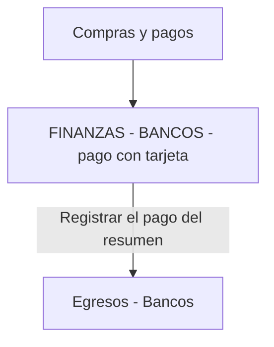

# Registrar pagos relizados con tarjetas de credito

## 💳 Pago con Tarjeta de Crédito

Este proceso describe cómo registrar tanto el uso de la tarjeta como el pago posterior de la liquidación o resumen bancario. A diferencia de un pago en efectivo, la tarjeta de crédito genera una deuda con una entidad bancaria que debe ser cancelada en el módulo de **Egresos**.

## 1. Registro de la Compra (Uso de la Tarjeta)

Al momento de ejecutar una compra o registrar la compra, se debe cargar lo que se compro o un articulo que refleje lo comprado.

- **Efecto en el sistema:** El sistema reconoce que el proveedor ha sido "pagado", pero la deuda se traslada internamente a la entidad emisora de la tarjeta (Visa, Master, etc.).
- **📍 Ubicación:** `FINANZAS > BANCOS > Pago con tarjeta de credito`.
- Se debe seleccionar como proveedor la `Tarjeta de credito`.
- Se debe poner le monto total de la compra generando asi la deuda con la tarjeta de credito.
- una vez cargado y verificado se puede archivar.

:::warning
Es importante saber que si el proveedor tiene una cuenta corriente creada o esta habilitado para tenerla, en la Actividad Compras y pagos se debe poner Proveedor Generico.
:::
:::info
Es importante colocar una referencia facil de entender y de buscar ya que en el siguietne paso es importante referenciar este paso para que el reporte de gastos lo pueda visualizar.
:::

## 2. Registrar el Pago de la Tarjeta (Liquidación)

Este paso se realiza cuando vence el resumen de la tarjeta y se transfiere dinero desde una cuenta bancaria para cancelar la deuda con la entidad.

- 📍 Ubicación:`Finanzas > Egresos > Bancos > Pago con Tarjeta`

En esta pantalla se completan los datos para registrar la salida real de dinero:

| Campo                  | Descripción                                                     |
| ---------------------- | --------------------------------------------------------------- |
| **Entidad/Tarjeta:**   | Selección de la tarjeta que se está pagando (ej. Visa Macro).   |
| **Fecha de Pago:**     | Fecha en la que se debita el monto del resumen.                 |
| **Importe Principal:** | Monto total de los consumos del período.                        |
| **Intereses/Gastos:**  | Cargos administrativos o intereses de financiación (si aplica). |
| **Comprobante:**       | Número de transacción o referencia del pago bancario.           |
| **Cuenta de Origen:**  | Cuenta bancaria de donde sale el dinero para el pago.           |

::: info

- :bulb: **Dato Clave:** El pago de la tarjeta suele incluir consumos de múltiples órdenes de compra. Al registrar el egreso aquí.
- En este paso se debe asociar el pago de la tarjeta. no con la factura
  :::

### 📄 ¿Cómo manejar las cuotas?

Si una compra se realizó en cuotas, el sistema lo gestionará de la siguiente manera:

- **En la compra:** Se registra el total de la operación.
- **En el pago de tarjeta:** Solo se debe registrar la cuota correspondiente al mes actual de la liquidación.

## 🛋️ Ejemplo práctico

- **Compra de insumos:** Se compran resmas de papel por **$50.000** con Tarjeta Visa en 1 pago.
- Se registra el Egreso > bancos > Pagos con tarjeta de credito, seleccionando "Tarjeta Visa". El proveedor queda saldado y aumenta al deuda con la tarjeta.

- **Cierre de resumen:** A fin de mes, llega el resumen de Visa por **$50.000** + **$1.500** de gastos administrativos.
- En **Egresos - Bancos**, se selecciona la Tarjeta Visa, se marcan los $50.000, se agregan los $1.500 como "Gastos Bancarios" y se confirma la salida desde la Cuenta Corriente.

::: warning
:no_entry: **Importante:** No borres compras realizadas con tarjeta si el resumen ya fue pagado, esto desajustará el saldo histórico de tu conciliación bancaria.
:::
