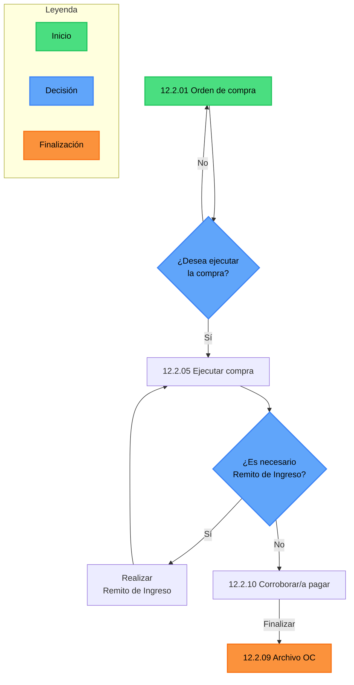

# Flujo de Compras y Pagos

El siguiente flujo corresponde al circuito administrativo de **Compras y Pagos** dentro del sistema.  
Su función principal es servir como **índice de archivos y pasos a seguir** para garantizar que cada operación quede correctamente documentada y archivada.

## Diagrama

# Flujo de Compras y Pagos

Este flujo refleja lo que ocurre en la **realidad de una empresa** cuando se realizan compras.  
El sistema no es más que el espejo digital de lo que pasa día a día: pedir mercadería, verificar si se recibe, y luego archivar los documentos para poder consultarlos más adelante en los reportes.

## Descripción del proceso real

1. **Orden de compra (12.2.01)**  
   En la práctica, este paso representa la **decisión de comprar algo**: un insumo, una mercadería o un material necesario.
   - Aquí se pide lo que se necesita al proveedor.
   - La Orden de Compra es el documento que respalda ese pedido.

2. **Decisión de ejecución**  
   Una vez que la orden está hecha, la empresa debe definir si **realmente se ejecuta** (es decir, si se confirma la compra).
   - Si no se aprueba, la compra no se lleva adelante.
   - Si se aprueba, se avanza hacia la ejecución.

3. **Ejecutar compra (12.2.05)**  
   Este paso corresponde al **momento en que efectivamente se hace la compra**.
   - Se concreta el pago o el compromiso con el proveedor.
   - La empresa recibe la confirmación de que la mercadería está en camino o se entrega.

4. **Remito de Ingreso**  
    Cuando el proveedor entrega la mercadería, lo hace con un **remito**.
   - Ese remito es la prueba de que los bienes ingresaron realmente a la empresa.
   - En este momento se revisa que lo recibido coincida con lo que se pidió (cantidad, calidad, precios).
   - Si corresponde, se carga el remito como respaldo.
     ::: info
     :bulb: [Ver infomacio sobre remitos](../../casosParticulares/remito/remitos.md)
     :::

5. **Corroborar/a pagar(12.2.10)**
   Este paso se agrega como una instancia para verificar, como asi para las facturas que estan pendientes de pago haciendo mas facil la busqueda en [Egresos](../../egresos/egresos.md).
   Una vez registrado el pago o verificado/corregido el registro este debe ser archivado.

6. **Archivo OC (12.2.09)**  
   Una vez finalizada la compra y recibido el remito, la Orden de Compra se **archiva**.
   - En la vida real, esto significa guardar la documentación (OC + remito) en los registros de la empresa.
   - En el sistema, queda archivada y disponible para consultarse en el **Reporte de Compras**, lo que permite hacer un seguimiento histórico de todas las operaciones.

## Importancia del flujo

Este proceso es clave porque:

- **Ordena la gestión**: refleja cada paso real de una compra, desde el pedido hasta el archivo.
- **Genera trazabilidad**: se puede comprobar qué se pidió, qué se recibió y cómo se cerró la operación.
- **Facilita el control**: evita que se pierdan documentos o que queden compras sin registrar.
- **Alimenta los reportes**: gracias a este flujo, la empresa puede ver en los reportes de compras qué se compró, a quién y en qué condiciones.

## Video

<ClientOnly>
  <lite-youtube 
    videoid="0ZiHAWxi2nw" 
    videotitle="Flujo de Compras"
  />
</ClientOnly>
