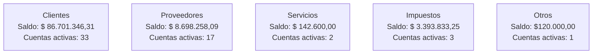

# Manual de Uso: Reporte "Estado Integral de Cuentas"

## 1. Objetivo del reporte

El reporte **Estado Integral de Cuentas** permite visualizar de manera consolidada el saldo de las cuentas relacionadas con clientes, proveedores, servicios e impuestos que tengan asociado una cuenta corriente. Facilitado el seguimiento de la situación financiera de cada parte interesada, así como la identificación de cuentas a cobrar o a pagar.

## 2. Navegación general

Al abrir el reporte, se visualizan las siguientes secciones principales:

### 2.1 Menú de opciones

- **Grupos:** permite filtrar las cuentas según su tipo:

  - `---` : Muestra todos los grupos sin filtro.
  - `Proveedor` : Solo cuentas de proveedores.
  - `Cliente` : Solo cuentas de clientes.
  - `Otro` : Cuentas clasificadas como "Otros".
  - `Impuestos` : Cuentas relacionadas con impuestos.
  - `Servicios` : Cuentas relacionadas con servicios.

- **Botones**:

  - `Aplicar`: Aplica el filtro seleccionado.
  - `Restablecer`: Elimina los filtros y muestra todos los registros.

::: warning
:bulb: **Recuerda:** siempre haz clic en **Aplicar** después de cambiar los filtros para que se apliquen los cambios.  
:::

## 3. Resumen de saldos

En la parte superior del reporte se muestra un resumen por grupo:

**Notas:**

- Este resumen permite identificar rápidamente el total de saldos por tipo de cuenta.
- "Cuentas activas" indica la cantidad de cuentas con movimientos pendientes.

## 4. Detalle de cuentas

Debajo del resumen se muestra la tabla con los detalles de cada cuenta:

| Columna           | Descripción                                                |
| ----------------- | ---------------------------------------------------------- |
| **Identificador** | Nombre del cliente, proveedor o servicio y su ID interno.  |
| **DEBE**          | Total de cargos o montos a favor de la cuenta.             |
| **HABER**         | Total de pagos o créditos aplicados a la cuenta.           |
| **SALDO**         | Diferencia entre DEBE y HABER. Muestra el monto pendiente. |
| **Situación**     | Estado de la cuenta:                                       |

- `A COBRAR`: El cliente tiene un saldo pendiente.
- `A PAGAR`: La empresa debe a un proveedor. |
  | **Días** | Cantidad de días transcurridos desde la última venta si es cliente o bien desde la ultima compra si es proveedor|
  | **Ver Movimientos** | Enlace que permite acceder al detalle de los movimientos de la cuenta. |

**Ejemplo de interpretación:**

| identificador        | DEBE          | HABER         | SALDO                  | Días                                 |
| -------------------- | ------------- | ------------- | ---------------------- | ------------------------------------ |
| 4072 - Audano Andrés | $4.000.000,00 | $8.260.000,00 | $4.260.000,00 a cobrar | 2 (desde la última venta registrada) |

## 5. Funcionalidades adicionales

- **Filtrado de información:** Seleccionando un grupo en el menú y presionando "Aplicar", la tabla se actualizará mostrando solo las cuentas del grupo seleccionado.
- **Ver movimientos:** Al hacer clic en "VER MOVIMIENTOS" se abrirá un detalle histórico de la cuenta seleccionada.
- **Restablecer filtros:** Permite volver a la vista general sin ningún filtro aplicado.

## 6. Buenas prácticas

- Revisar primero el **resumen de saldos** para identificar rápidamente cuentas con movimientos importantes.
- Usar el **filtro por grupo** para enfocar el análisis en clientes, proveedores u otro tipo de cuentas.
- Consultar el **detalle de movimientos** antes de tomar decisiones sobre cobranzas o pagos.
- Verificar periódicamente los saldos y días de antigüedad para mantener la información actualizada.

## 7. Video
